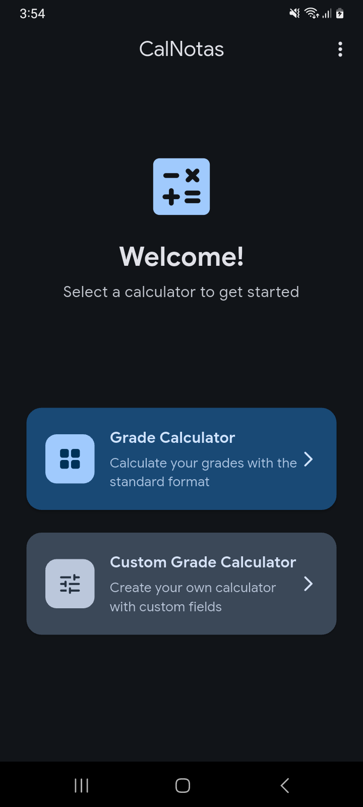
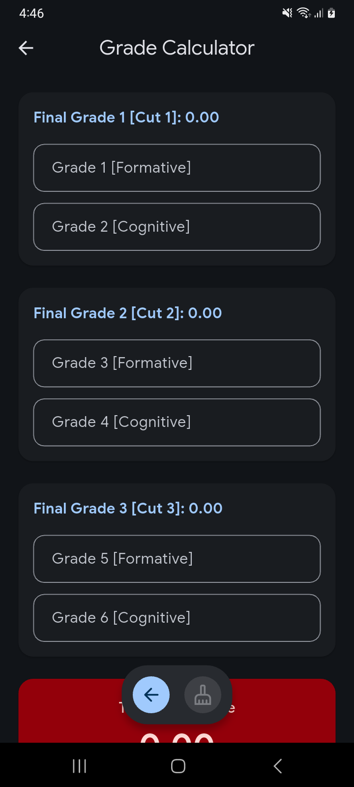
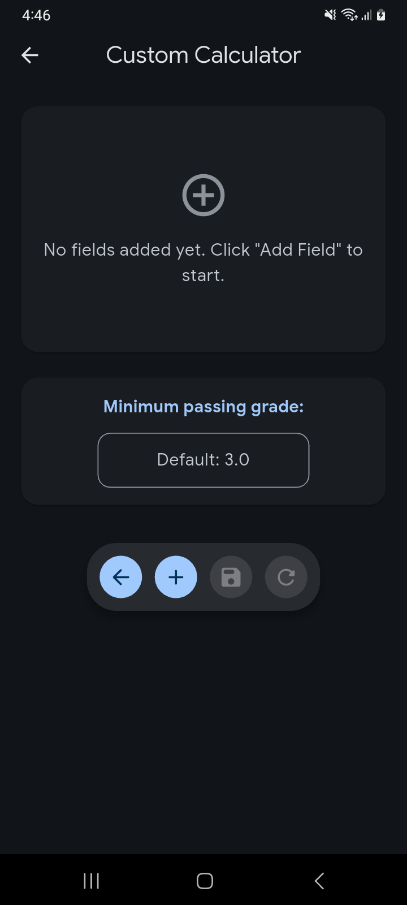

# CalNotas - Grade Calculator App

<p align="center">
  
  
  
  
  
  
</p>

A modern, intuitive grade calculator app built with Flutter and Material Design 3. Perfect for students who need to track and calculate their academic grades with customizable evaluation percentages.

## Features

### Default Grade Calculator
- Pre-configured calculator for standard academic grading systems
- Calculates grades across 3 evaluation periods (cortes)
- Supports formative (15%) and cognitive (15-20%) grade components
- Real-time grade calculation as you type

### Custom Grade Calculator
- Create unlimited custom grade fields
- Define your own evaluation names and percentages
- Automatic validation of total percentage (must equal 100%)
- Save and load your custom calculator configurations
- Set minimum passing grade threshold

### Modern UI/UX
- **Material Design 3** with expressive color schemes
- **Dynamic theming** - Light, Dark, and System modes
- **Google Sans** typography for clean, readable text
- Floating toolbar design for easy access to actions
- Smooth animations and transitions

### Multi-language Support
- English (en-US)
- Spanish (es-ES)
- Automatic language detection on first launch

### Update Checker
- Built-in update checker via GitHub Releases API
- View release notes and download updates directly
- Version comparison with semantic versioning

### Additional Features
- Comprehensive help section with usage instructions
- About screen with app information
- Input validation with helpful error messages
- Persistent settings and calculator data

## Screenshots

<p align="center">
  
  
  
</p>

| Home | Default Calculator | Custom Calculator |
|:----:|:------------------:|:-----------------:|
| Main menu with quick access to calculators | Standard grade calculator with 3 periods | Create your own custom grade fields |

## Requirements

- **Android 8.0 (Oreo) to Android 16** (API level 26-36)
- ~55 MB storage space
- compileSdk: 36, targetSdk: 35, minSdk: 26

## Installation

### From GitHub Releases
1. Go to [Releases](https://github.com/dony-aep/calnotas/releases)
2. Download the latest `app-release.apk`
3. Install on your Android device

### Build from Source
```bash
# Clone the repository
git clone https://github.com/dony-aep/calnotas.git
cd calnotas

# Get dependencies
flutter pub get

# Build release APK
flutter build apk --release
```

The APK will be generated at `build/app/outputs/flutter-apk/app-release.apk`

## Tech Stack

- **Framework:** Flutter 3.38+
- **Language:** Dart 3.10+
- **Design System:** Material Design 3
- **State Management:** Provider
- **HTTP Client:** http package
- **Local Storage:** SharedPreferences
- **Build Tools:** Java 17, Gradle 8.x, AGP 8.x

## License

This project is licensed under the MIT License - see the [LICENSE](LICENSE) file for details.

## Author

**dony.**
- GitHub: [@dony-aep](https://github.com/dony-aep)
