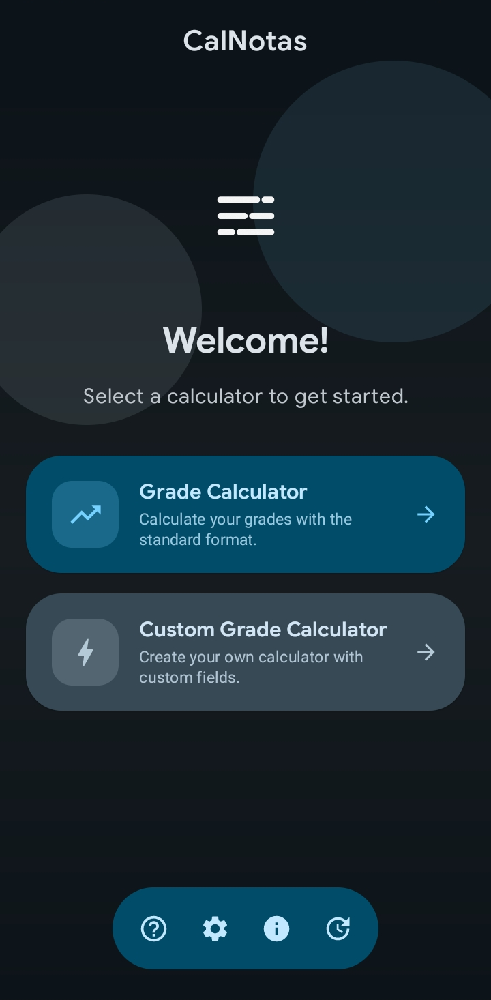
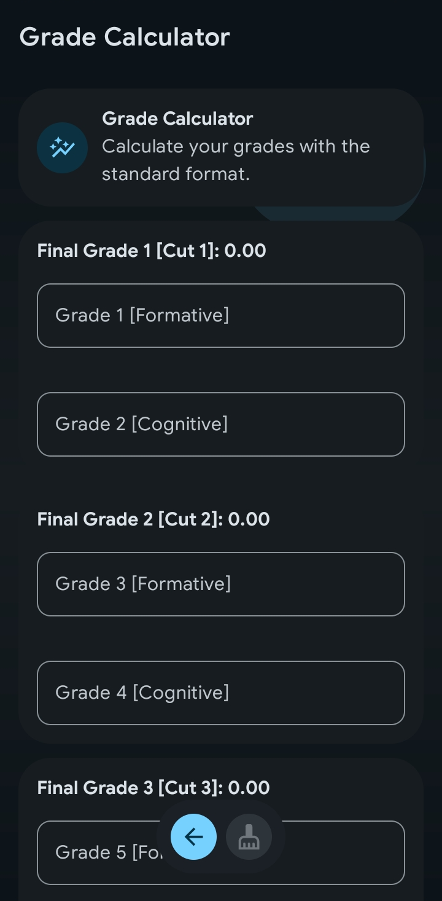
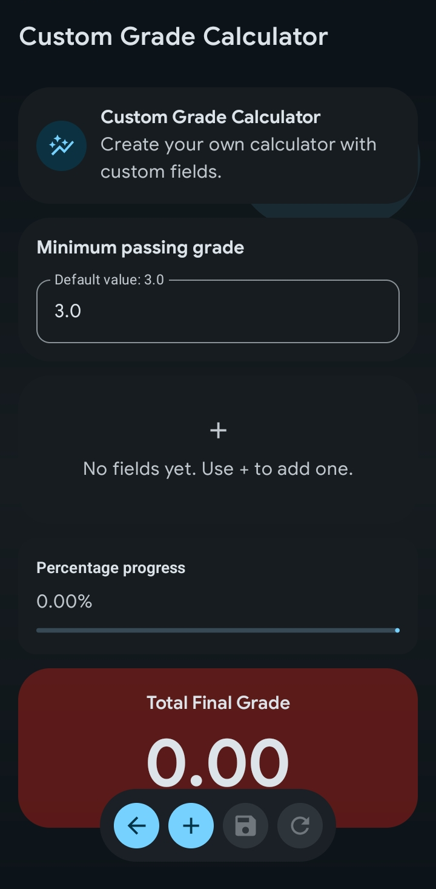

# CalNotas - Android Native (Kotlin)

<p align="center">
  
  
  
  
  
  
</p>

CalNotas is a modern grade calculator app for Android, migrated from Flutter to native Kotlin using Jetpack Compose and Material 3 Expressive.

## Features

### Default Grade Calculator
- Preconfigured calculator for standard grading systems
- Calculation across 3 periods
- Formative and cognitive components
- Real-time updates while typing

### Custom Grade Calculator
- Add and remove custom evaluation fields
- Define names, percentages, and grades
- Validation for 100% total percentage
- Configurable minimum passing grade

### UI and Experience
- Material 3 Expressive design system
- Light, Dark, and System appearance modes
- Dynamic app language (Spanish / English)
- Floating toolbar and updated visual style

### Extra
- Built-in update checker via GitHub Releases API
- Help and About sections
- Persistent settings and calculator data

## Screenshots

<p align="center">
  
  
  
</p>

| Home | Default Calculator | Custom Calculator |
|:----:|:------------------:|:-----------------:|
| Main menu and quick access | Calculator with predefined structure | Flexible calculator with custom fields |

## Requirements

- Android 8.0+ (API 26+)
- JDK 11+
- Android Studio (latest stable recommended)

## Installation

### From GitHub Releases
1. Open [Releases](https://github.com/dony-aep/calnotas/releases)
2. Download the latest `calnotas_v<version>_release.apk`
3. Install on your Android device

### Build from Source
```bash
git clone https://github.com/dony-aep/calnotas.git
cd calnotas
./gradlew assembleRelease
```

Generated APK:
`app/build/outputs/apk/release/app-release.apk`

## Tech Stack

- Kotlin 2.2.10
- Jetpack Compose + Material 3 Expressive
- Navigation Compose
- DataStore Preferences
- Retrofit + OkHttp
- Gradle (KTS) + Android Gradle Plugin

## License

This project is licensed under the MIT License. See [LICENSE](LICENSE).

## Author

**dony.**
- GitHub: [@dony-aep](https://github.com/dony-aep)
